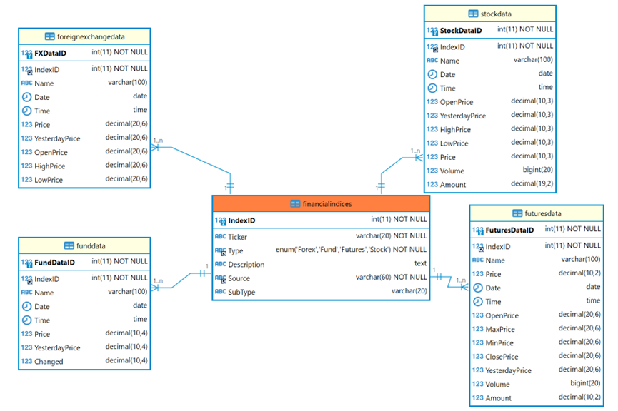
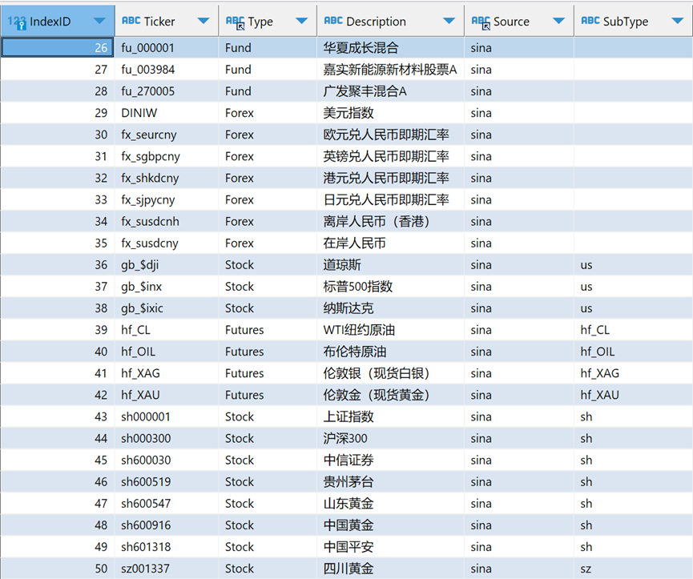

# 数据库建立配置

配置项表不参与行情数据存储，具体数据存储于多个对应具体类型的子表中，通过外键于配置项表IndexID进行关联。对配置项表设置了插入触发器，使得合法新增配置项会自动于子表创建数据存储项，外键同时设置为ON DELETE CASCADE。



示例主配置表配置：



## 数据库建立

```sql
CREATE TABLE `financialindices` (
  `IndexID` int(11) NOT NULL AUTO_INCREMENT,
  `Ticker` varchar(20) NOT NULL,
  `Type` enum('Forex','Fund','Futures','Stock') NOT NULL,
  `Description` text,
  `Source` varchar(60) NOT NULL,
  `SubType` varchar(20) DEFAULT NULL,
  PRIMARY KEY (`IndexID`),
  KEY `financialindices_Source_IDX` (`Source`) USING BTREE,
  KEY `financialindices_Type_IDX` (`Type`) USING BTREE
)
CREATE TABLE `foreignexchangedata` (
  `FXDataID` int(11) NOT NULL AUTO_INCREMENT,
  `IndexID` int(11) NOT NULL,
  `Name` varchar(100) DEFAULT NULL,
  `Date` date DEFAULT NULL,
  `Time` time DEFAULT NULL,
  `Price` decimal(20,6) DEFAULT NULL,
  `YesterdayPrice` decimal(20,6) DEFAULT NULL,
  `OpenPrice` decimal(20,6) DEFAULT NULL,
  `HighPrice` decimal(20,6) DEFAULT NULL,
  `LowPrice` decimal(20,6) DEFAULT NULL,
  PRIMARY KEY (`FXDataID`),
  KEY `foreignexchangedata_financialindices_FK` (`IndexID`),
  CONSTRAINT `foreignexchangedata_ibfk_1` FOREIGN KEY (`IndexID`) REFERENCES `financialindices` (`IndexID`) ON DELETE CASCADE
)
CREATE TABLE `funddata` (
  `FundDataID` int(11) NOT NULL AUTO_INCREMENT,
  `IndexID` int(11) NOT NULL,
  `Name` varchar(100) DEFAULT NULL,
  `Date` date DEFAULT NULL,
  `Time` time DEFAULT NULL,
  `Price` decimal(10,4) DEFAULT NULL,
  `YesterdayPrice` decimal(10,4) DEFAULT NULL,
  `Changed` decimal(10,4) DEFAULT NULL,
  PRIMARY KEY (`FundDataID`),
  KEY `funddata_financialindices_FK` (`IndexID`),
  CONSTRAINT `funddata_financialindices_FK` FOREIGN KEY (`IndexID`) REFERENCES `financialindices` (`IndexID`) ON DELETE CASCADE

)
CREATE TABLE `futuresdata` (
  `FuturesDataID` int(11) NOT NULL AUTO_INCREMENT,
  `IndexID` int(11) NOT NULL,
  `Name` varchar(100) DEFAULT NULL,
  `Price` decimal(10,2) DEFAULT NULL,
  `Date` date DEFAULT NULL,
  `Time` time DEFAULT NULL,
  `OpenPrice` decimal(20,6) DEFAULT NULL,
  `MaxPrice` decimal(20,6) DEFAULT NULL,
  `MinPrice` decimal(20,6) DEFAULT NULL,
  `ClosePrice` decimal(20,6) DEFAULT NULL,
  `YesterdayPrice` decimal(20,6) DEFAULT NULL,
  `Volume` bigint(20) DEFAULT NULL,
  `Amount` decimal(10,2) DEFAULT NULL,
  PRIMARY KEY (`FuturesDataID`),
  KEY `futuresdata_financialindices_FK` (`IndexID`),
  CONSTRAINT `futuresdata_financialindices_FK` FOREIGN KEY (`IndexID`) REFERENCES `financialindices` (`IndexID`) ON DELETE CASCADE
)
CREATE TABLE `stockdata` (
  `StockDataID` int(11) NOT NULL AUTO_INCREMENT,
  `IndexID` int(11) NOT NULL,
  `Name` varchar(100) DEFAULT NULL,
  `Date` date DEFAULT NULL,
  `Time` time DEFAULT NULL,
  `OpenPrice` decimal(10,3) DEFAULT NULL,
  `YesterdayPrice` decimal(10,3) DEFAULT NULL,
  `HighPrice` decimal(10,3) DEFAULT NULL,
  `LowPrice` decimal(10,3) DEFAULT NULL,
  `Price` decimal(10,3) DEFAULT NULL,
  `Volume` bigint(20) DEFAULT NULL,
  `Amount` decimal(19,2) DEFAULT NULL,
  PRIMARY KEY (`StockDataID`),
  KEY `stockdata_financialindices_FK` (`IndexID`),
  CONSTRAINT `stockdata_financialindices_FK` FOREIGN KEY (`IndexID`) REFERENCES `financialindices` (`IndexID`) ON DELETE CASCADE
)
```

触发器

```sql
CREATE DEFINER=`Administrator`@`%` TRIGGER add_watch
AFTER INSERT
ON financialindices FOR EACH ROW
begin
    IF NEW.type IN ('Forex', 'Fund', 'Futures', 'Stock') THEN
        CASE NEW.type
            WHEN 'Forex' THEN
                INSERT INTO foreignexchangedata (IndexID) VALUES (NEW.IndexID);
            WHEN 'Fund' THEN
                INSERT INTO funddata (IndexID) VALUES (NEW.IndexID);
            WHEN 'Futures' THEN
                INSERT INTO futuresdata (IndexID) VALUES (NEW.IndexID);
            WHEN 'Stock' THEN
                INSERT INTO stockdata (IndexID) VALUES (NEW.IndexID);
        END CASE;
    END IF;
END
```

